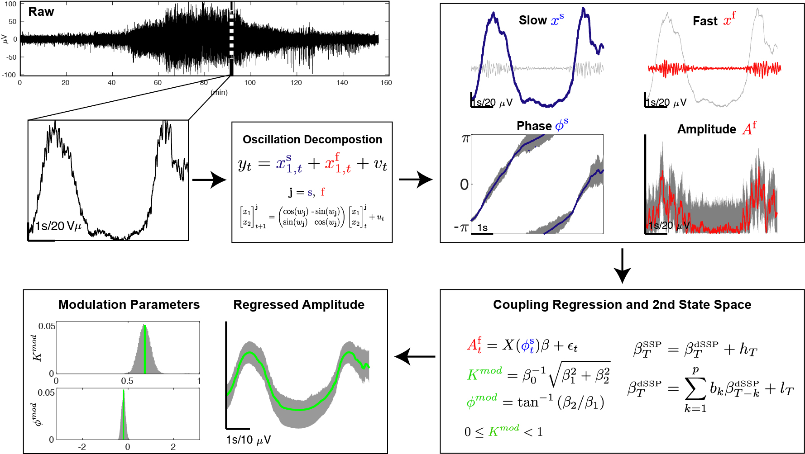

====================================
State-Space Phase Amplitude Coupling
====================================

.. image:: https://img.shields.io/badge/matlab-2017b-red.svg
    :alt: matlab
    :target: https://github.mit.edu/hsoulat/SSP

(**d**\ ouble)  **S**\ tate **S**\ pace **P**\ hase amplitude coupling methods are detailed and derived in the paper:

https://doi.org/10.1038/s41598-022-18475-3

Summary
============

(d)SSP uses and extend the oscillation decomposition proposed by `Matsuda and Komaki (2017) <https://www.mitpressjournals.org/doi/10.1162/NECO_a_00916>`_ to model neural data. We then linearly parametrize the phase amplitude coupling (PAC) relationship between a fast and a slow oscillation  and integrate it within a second level state space to estimate PAC dynamics.

1) Oscillation decomposition
	``ssp_decomp``  decomposes the signal y_t in a set of 2 dimensional time series x_t_N (which number and harmonics is fixed or is selected through an Information Criteria). This "analytic fit" gives a straightforward access to (i) the slow oscillation phase Phi_s and fast oscillation amplitude A_f (ii) The posterior distribution p(A_f, Phi_s | {y_t}_{t=1..N}) which can be use to resample the time series.

2) Phase amplitude Coupling Estimation
	``ssp_pac`` uses the results in a linear regression to estimate the coupling relationship A_f = f(Phi_s) beta + epsilon. From which we deduce p(beta | A_f, Phi_s) and p(beta | {y_t}_{t=1..N}). Finally, we can use multivariate Autoregressive Process (AR) with observation noise on beta to learn PAC dynamics.

*% (DSS is the old name of the algorithm)
